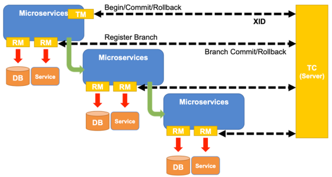

  <h1 align="center">Seata 分布式事务</h1>
  

    <a href="README.md"><strong>English</strong></a> | <strong>简体中文</strong>
  

## 目录

- [仓库简介](#项目介绍)
- [前置条件](#前置条件)
- [镜像说明](#镜像说明)
- [获取帮助](#获取帮助)
- [如何贡献](#如何贡献)

## 项目介绍
[Seata](https://github.com/apache/incubator-seata) **Seata** 是一款开源的分布式事务解决方案，提供高性能且简单易用的**AT、TCC、SAGA、XA**事务模式，确保微服务架构下的数据一致性。

**Seata 的核心特性**包括：

1. **多事务模式支持**
    - **AT（自动补偿型）**：基于本地事务+全局锁，高性能、低侵入，适用于大多数场景。
    - **TCC（Try-Confirm-Cancel）**：通过业务编码实现两阶段提交，适合高一致性要求的场景。
    - **SAGA**：长事务解决方案，通过状态机编排服务，支持最终一致性。
    - **XA**：基于数据库XA协议，强一致性，但性能较低。

2. **全局事务管理**
    - 通过 **TC（Transaction Coordinator）** 协调分布式事务，统一管理分支事务的提交/回滚。

3. **高可用与扩展性**
    - 支持集群部署，TC可注册到Nacos、Eureka等注册中心，保障高可用。
    - 存储模式支持DB、Redis等，灵活适配不同场景。

4. **低侵入性**
    - 通过代理数据源（AT模式）或注解（TCC/SAGA），业务代码几乎无侵入。

5. **强一致性保障**
    - 全局锁机制防止脏写，AT模式自动生成反向SQL补偿数据，确保事务原子性。

6. **生态兼容**
    - 支持Dubbo、Spring Cloud、gRPC等微服务框架，兼容MySQL、Oracle、PostgreSQL等主流数据库。

**总结**：Seata以灵活的事务模式、高可用架构和低侵入设计，成为解决分布式事务问题的核心工具。

本项目提供的开源镜像商品 [**`Seata-监控和告警工具`**](https://marketplace.huaweicloud.com/hidden/contents/9e9217e1-5c9d-4026-96bd-b3395d0c9aa8#productid=OFFI1131118959554052096)，已预先安装 Seata 软件及其相关运行环境，并提供部署模板。快来参照使用指南，轻松开启“开箱即用”的高效体验吧。

**架构设计：**

> **系统要求如下：**
> - CPU: 2vCPUs 或更高
> - RAM: 4GB 或更大
> - Disk: 至少 50GB

## 前置条件
[注册华为账号并开通华为云](https://support.huaweicloud.com/usermanual-account/account_id_001.html)

## 镜像说明

| 镜像规格                                                                                                                                              | 特性说明 | 备注 |
|---------------------------------------------------------------------------------------------------------------------------------------------------| --- | --- |
| [Seata2.3.0-arm-v1.0](https://marketplace.huaweicloud.com/hidden/contents/9e9217e1-5c9d-4026-96bd-b3395d0c9aa8#productid=OFFI1131118959554052096) | 基于鲲鹏服务器 + Huawei Cloud EulerOS 2.0 64bit 安装部署 |  |

## 获取帮助
- 更多问题可通过 [issue](https://github.com/HuaweiCloudDeveloper/seata-image/issues) 或 华为云云商店指定商品的服务支持 与我们取得联系
- 其他开源镜像可看 [open-source-image-repos](https://github.com/HuaweiCloudDeveloper/open-source-image-repos)

## 如何贡献
- Fork 此存储库并提交合并请求
- 基于您的开源镜像信息同步更新 README.md